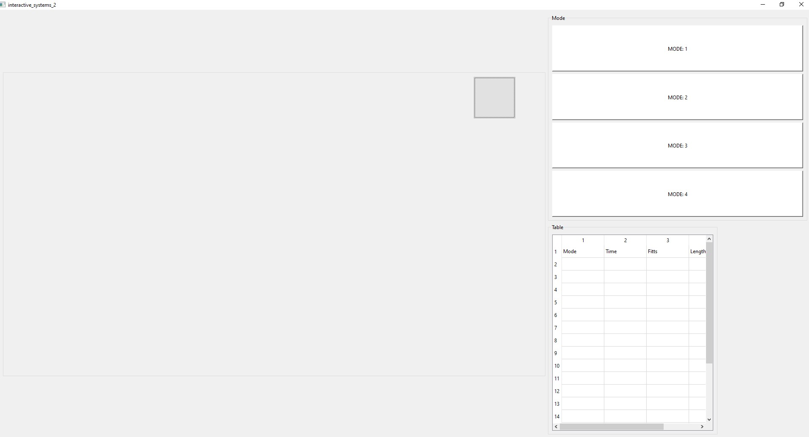

# Измерение времени реакции пользователя на события от манипулятора "мышь". Использование метода Фиттса
Стандартное окно, содержащее кнопку фиксированного размера в правой части окна, четыре кнопки для переключения режима работа программы, и таблицу для вывода результатов измерения.

Режимы:
- Курсор мыши появляется на фиксированном расстоянии, находящимся на одной горизонтальной линии с кнопкой фиксированного размера
- Курсор мыши появляется на произвольном расстоянии, находящимся на одной горизонтальной линии с кнопкой фиксированного размера
- Курсор мыши появляется на фиксированном расстоянии, находящимся на одной горизонтальной линии с кнопкой произвольного размера
- Курсор мыши появляется на произвольном расстоянии, находящимся в пределах рабочего окна, за исключением площади, занимаемого кнопкой

Главное окно

# Инструкция
После появления курсора переместить указатель на изображение кнопки и воздействовать на неё с помощью левой кнопки мыши (ЛКМ).

# Требования
Скачать и установить Qt Creator

# Клонирование репозитория
git clone https://github.com/nKadykov/interactive_systems_2
